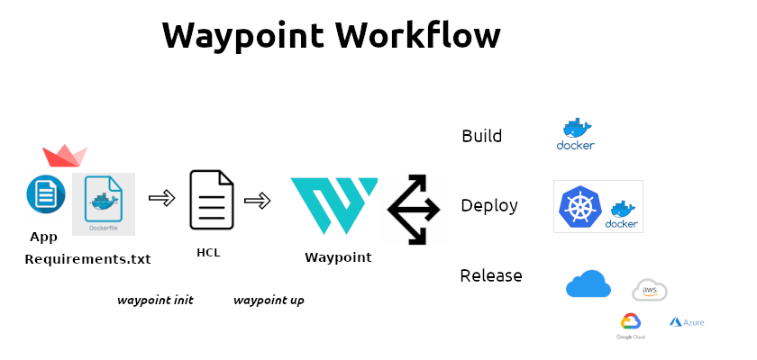

### DisplaCify App
#### Using Displacy in Flask

+ This is to demonstrate how to render Named Entity Recognition with Displacy in Flask

#### Requirements
+ Flask
+ Flask-Markdown
+ Spacy


#### Images


#### Build and Deploy with Waypoint



#### Requirements For Deployment
+ App
+ requirements.txt
+ Dockerfile
+ waypoint.hcl 

#### Steps
```bash
docker pull hashicorp/waypoint:latest
```

#### Set up Waypoint Server For Docker
```bash
waypoint install -platform=docker -accept-tos
```
#### Initialize and Build
```bash
waypoint init
waypoint up
```
#### View UI
```bash
waypoint ui -authenticate
```

#### Access Container
```bash
waypoint exec bash
```

#### Destroy Deployment
```bash
waypoint destroy
```

#### By
+ Jesse E.Agbe(JCharis)
+ Jesus Saves@JCharisTech
