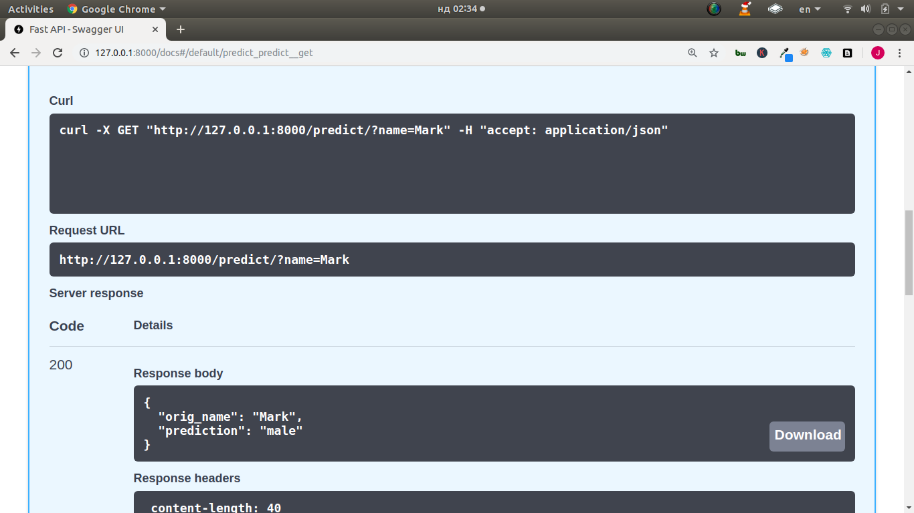
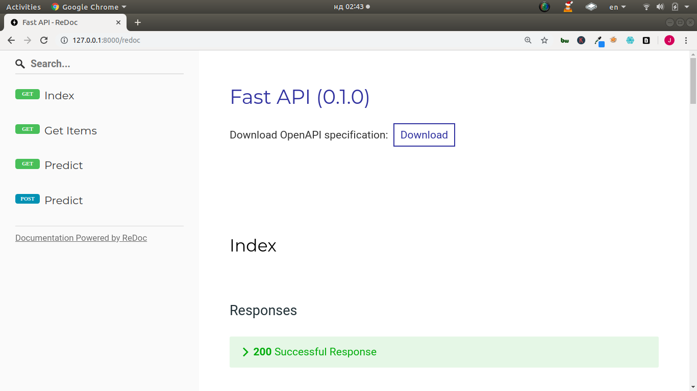

### Serving Machine Learning Models as API

+ Using FastAPI

#### Installation
```bash
pip install fastapi
```

#### Requires ASGI server to work
+ uvicorn or hypercorn
```bash
pip install uvicorn
```

#### Screenshot








### By 
+ Jesse E.Agbe(JCharis)
+ J-Secur1ty
+ Jesus Saves@JCharisTech